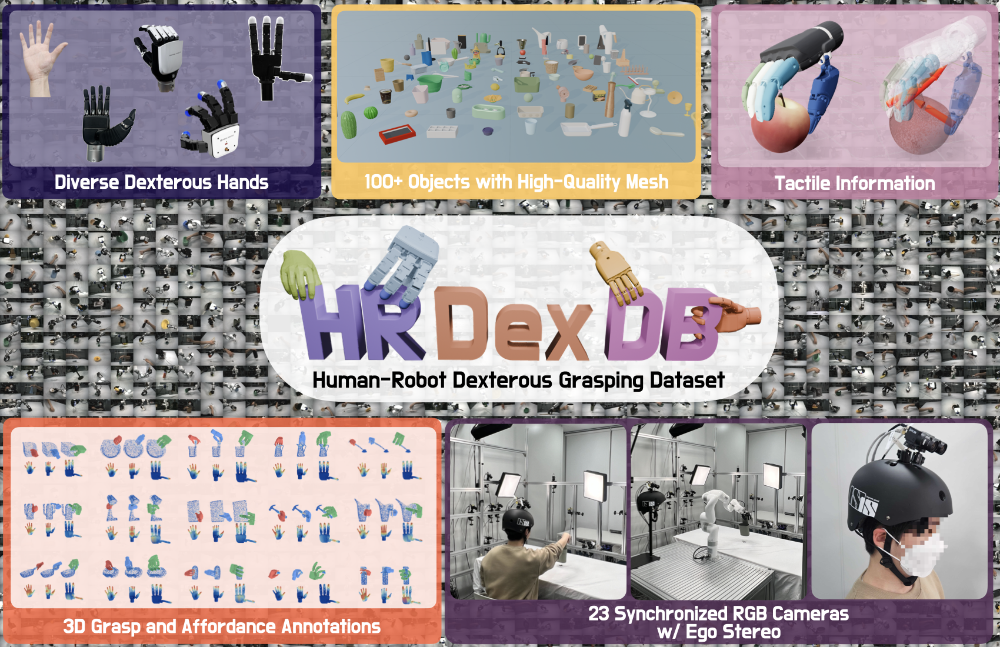

<div align="center">

# 🤖 HRDexDB

### A Paired Human-Robot Dataset for Cross-Embodiment Dexterous Grasping

Jongbin Lim<sup>1,*</sup> · Taeyun Ha<sup>1,*</sup> · Mingi Choi<sup>1</sup> · Jisoo Kim<sup>1</sup> · Byungjun Kim<sup>1</sup> · Subin Jeon<sup>1</sup> · Hanbyul Joo<sup>1,2,†</sup>

<sup>1</sup> Seoul National University · <sup>2</sup> RLWRLD

<sup>*</sup> Equal contribution · <sup>†</sup> Corresponding author

[📄 Paper](https://arxiv.org/abs/2604.14944) |
[🌐 Project Page](https://snuvclab.github.io/HRDexDB/) |
[📦 Dataset](https://snuvclab.github.io/HRDexDB/)

</div>

Official dataset repository and lightweight visualization toolkit for **HRDexDB**.

<p align="center">
  <b>TL;DR:</b> HRDexDB is a paired cross-embodiment dataset of high-fidelity dexterous grasping sequences featuring both human and robotic hands.
</p>

<p align="center">
  
</p>

## Dataset Overview

HRDexDB provides paired dexterous grasping trajectories across human hands and robotic hand embodiments, captured on the same target objects under comparable grasping motions. The dataset includes synchronized visual, kinematic, and 3D annotation modalities, with contact-force signals available for tactile-enabled robot hands.

Key statistics:

- **2.1K** grasping sequences
- **100+** diverse objects
- **5** hand embodiments
- **23** synchronized cameras
- High-precision 3D trajectories for both hand/robot and manipulated objects

## Installation

```bash
git clone https://github.com/snuvclab/HRDexDB
cd HRDexDB

conda env create -f environment.yml
conda activate hrdexdb-vis
```

For an existing Python environment:

```bash
pip install -r requirements.txt
```

All commands below assume they are run from the repository root.

## Dataset Placement

Place the released dataset folder `v0` directly under the repository root:

```text
HRDexDB/
├── README.md
├── visualize_trajectory.py
├── hrdexdb/
├── assets/
│   └── robots/
└── v0/
    ├── assets/
    │   └── mesh/
    │       └── <object_name>/
    │           └── <object_name>.obj
    ├── human/
    │   └── <object_name>/
    │       └── <scene_id>/
    └── inspire_f1/
        └── <object_name>/
            └── <scene_id>/
```

By default, the viewer resolves:

- dataset root: `./v0`
- object mesh root: `./v0/assets/mesh`

If `v0` is stored elsewhere, pass `--dataset-root /path/to/v0`. The mesh root then defaults to `/path/to/v0/assets/mesh`.

## Quick Visualization

Visualize an Inspire F1 robot scene:

```bash
python visualize_trajectory.py \
  --hand inspire_f1 \
  --object banana \
  --scene 2
```

Visualize a human hand scene:

```bash
python visualize_trajectory.py \
  --hand human \
  --object banana \
  --scene 2
```

Use a dataset stored outside the repository:

```bash
python visualize_trajectory.py \
  --dataset-root /path/to/v0 \
  --hand inspire_f1 \
  --object french_mustard \
  --scene 2
```

## Expected Scene Layout

Each scene is expected to follow this structure:

```text
<dataset-root>/<hand>/<object>/<scene_id>/
├── cam_param/
│   ├── intrinsics.json
│   ├── extrinsics.json
│   └── ego_calib.json          # optional, for human ego cameras
├── C2R.npy                    
├── object_6d/
│   └── pose_*.txt
└── vid/
    └── <camera_id>.mp4

<dataset-root>/assets/mesh/<object>/<object>.obj
```

Robot scenes additionally include:

```text
raw/
├── arm/*.npy
├── hand/*.npy
└── timestamps/
    ├── timestamp.npy
    └── frame_id.npy
```

Human scenes include MANO mesh sequences under one of:

```text
hand/mano/*.obj
```

## Contact

For questions, please contact [Jongbin Lim](https://jongbinlim.github.io/) at [whdqls0534@snu.ac.kr](mailto:whdqls0534@snu.ac.kr) or [Taeyun Ha](https://hahahataeyun.github.io/) at [taeyun012@snu.ac.kr](mailto:taeyun012@snu.ac.kr).

## Citation

If you find HRDexDB useful, please cite:

```bibtex
@misc{lim2026hrdexdb,
      title={HRDexDB: A Paired Human-Robot Dataset for Cross-Embodiment Dexterous Grasping},
      author={Jongbin Lim and Taeyun Ha and Mingi Choi and Jisoo Kim and Byungjun Kim and Subin Jeon and Hanbyul Joo},
      year={2026},
      eprint={2604.14944},
      archivePrefix={arXiv},
      primaryClass={cs.RO},
      url={https://arxiv.org/abs/2604.14944},
}
```
