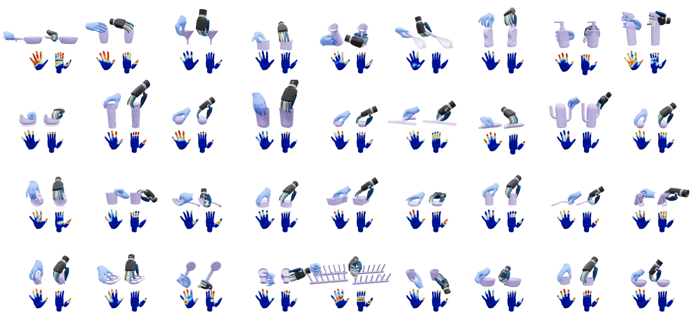
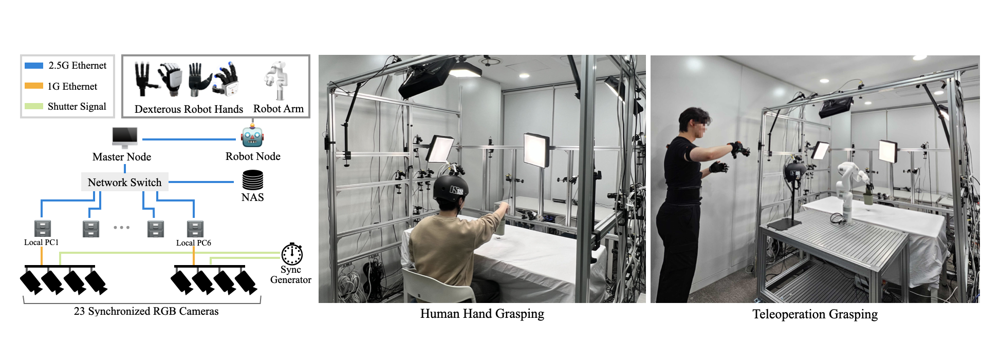

<section class="hero teaser">
    <div class="container is-max-desktop">
        <h2 class="subtitle has-text-centered">
            <span class="tldr-label">TL;DR:</span>
            <span class="tldr-text">A paired cross-embodiment dataset of high-fidelity <br>dexterous grasping sequences featuring both human and robotic hands</span>
        </h2>
    </div>
</section>

<div class="columns is-centered">
    <div class="column is-full">
        
    </div>
</div>

<!-- Using HTML to center the abstract -->
<div class="columns is-centered has-text-centered">
    <div class="column is-full">
        <h2 id="abstract">Abstract</h2>
        <div class="content has-text-justified">
We present <b>HRDexDB</b>, a paired cross-embodiment dexterous grasping dataset of high-fidelity dexterous grasping sequences featuring both human and diverse robotic hands. Unlike existing datasets, HRDexDB provides a comprehensive collection of grasping trajectories across human hands and multiple robot hand embodiments, spanning 100 diverse objects. Leveraging state-of-the-art vision methods and a dedicated multi-camera system, HRDexDB offers high-precision spatiotemporal 3D ground-truth motion for both the agent and the manipulated object. The dataset comprises 2.1K grasping trials, each enriched with synchronized visual and kinematic modalities, with contact-force signals available for tactile-enabled robotic hands. By providing closely aligned captures of human dexterity and robotic execution on the same target objects under comparable grasping motions, HRDexDB serves as a foundational benchmark for cross-embodiment dexterous manipulation.
        </div>
    </div>
</div>

<!-- > Note: This is an example of a Jekyll-based project website template: [Github link](https://github.com/shunzh/project_website).\
> The following content is generated by ChatGPT. The figure is manually added. -->

## Dataset Overview
{: #dataset}

**HRDexDB** is the first large-scale dataset featuring paired human and dexterous robotic hand manipulation.
It provides over **2.1K** sequences across **100** diverse objects and **5** distinct embodiments, all captured by a fully synchronized 23-camera system.
We provide detailed 3D annotations for every sequence. You can see a sample visualization of our dataset below.

<div class="dataset-stats" aria-label="HRDexDB dataset statistics">
    <div class="dataset-stat">
        <div class="dataset-stat-number">2.1K</div>
        <div class="dataset-stat-label">sequences</div>
    </div>
    <div class="dataset-stat">
        <div class="dataset-stat-number">100+</div>
        <div class="dataset-stat-label">objects</div>
    </div>
    <div class="dataset-stat">
        <div class="dataset-stat-number">5</div>
        <div class="dataset-stat-label">embodiments</div>
    </div>
</div>

<div class="dataset-video-tabs">
    <input class="dataset-video-tab-input" type="radio" name="dataset-video-tab" id="dataset-video-human" checked>
    <input class="dataset-video-tab-input" type="radio" name="dataset-video-tab" id="dataset-video-robot">

    <div class="dataset-video-tab-list" aria-label="Dataset overview videos">
        <label class="dataset-video-tab" for="dataset-video-human">Human</label>
        <label class="dataset-video-tab" for="dataset-video-robot">Robot</label>
    </div>

    <div class="dataset-video-panels">
        <figure class="dataset-video-panel dataset-video-panel-human">
            <div class="dataset-video-stage">
                <video class="dataset-video" controls playsinline preload="metadata" poster="./static/videos/human_grasping_poster.jpg">
                    <source src="./static/videos/human_grasping.mp4" type="video/mp4">
                    <source src="./static/videos/human_grasping.webm" type="video/webm">
                    Your browser does not support the video tag.
                </video>
                <div class="dataset-video-caption">
                    <p>High-fidelity human dexterous grasping sequences captured across diverse objects.</p>
                </div>
            </div>
        </figure>

        <figure class="dataset-video-panel dataset-video-panel-robot">
            <div class="dataset-video-stage">
                <video class="dataset-video" controls playsinline preload="metadata" poster="./static/videos/robot_grasping_poster.jpg">
                    <source src="./static/videos/robot_grasping.mp4" type="video/mp4">
                    <source src="./static/videos/robot_grasping.webm" type="video/webm">
                    Your browser does not support the video tag.
                </video>
                <div class="dataset-video-caption">
                    <p>Paired robot hand executions recorded with synchronized visual and kinematic modalities.</p>
                </div>
            </div>
        </figure>
    </div>
</div>

<div class="dataset-extra-media">
    <section class="dataset-media-block">
        <h3 class="dataset-media-title">3D Annotations</h3>
        <video class="dataset-video" controls playsinline preload="metadata">
            <source src="./static/videos/paired_annotations.mp4?v=web-h264-20260618" type="video/mp4">
            Your browser does not support the video tag.
        </video>
        <div class="dataset-video-caption">
            <p>Paired human and robot annotations visualized across synchronized views.</p>
        </div>
    </section>

    <section class="dataset-media-block">
        <h3 class="dataset-media-title">Contact Visualization</h3>
        
        <div class="dataset-video-caption">
            <p>Contact visualization highlighting interaction regions during grasping.</p>
        </div>
    </section>
</div>

<h3 class="dataset-media-title">Tactile Signals</h3>

Unlike other existing robot datasets, HRDexDB provides rich **tactile signals** for the Inspire & Allegro robotic hand series. 

<div class="columns is-centered">
    <div class="column is-full">
        <figure style="margin: 1.5rem 0 0 0;">
            <video class="dataset-video" controls playsinline preload="metadata">
                <source src="./static/videos/hrdex_realdex.mp4" type="video/mp4">
                Your browser does not support the video tag.
            </video>
            <div class="dataset-video-caption">
                <p>Tactile sensing stream synchronized with the grasping sequence.</p>
            </div>
        </figure>
    </div>
</div>


## A Unified Multi-Modal Data Capture System
{: #capture-system}

To construct HRDexDB, we developed a unified multi-modal capture platform. It features a dense rig of 23 synchronized cameras, integrated with real-time robot proprioception. This setup is specifically engineered to overcome severe occlusions during interaction with objects.


## Full Video
{: #full-video}

<div class="columns is-centered">
    <div class="column is-full">
        <figure style="margin: 0;">
            <video class="dataset-video" controls playsinline preload="metadata" poster="./static/videos/HRDexDB_poster.jpg">
                <source src="./static/videos/HRDexDB_video_CoRL_reduced_h264.mp4" type="video/mp4">
                Your browser does not support the video tag.
            </video>
            <figcaption class="dataset-video-caption">
                <p>Full HRDexDB overview video.</p>
            </figcaption>
        </figure>
    </div>
</div>


## Contact
{: #contact}

Send any comments or questions to [Jongbin Lim](https://jongbinlim.github.io/): [whdqls0534@snu.ac.kr](mailto:whdqls0534@snu.ac.kr) or [Taeyun Ha](https://hahahataeyun.github.io/): [taeyun012@snu.ac.kr](mailto:taeyun012@snu.ac.kr).


## Citation
{: #bibtex}
```
@misc{lim2026hrdexdb,
      title={HRDexDB: A Paired Human-Robot Dataset for Cross-Embodiment Dexterous Grasping}, 
      author={Jongbin Lim and Taeyun Ha and Mingi Choi and Jisoo Kim and Byungjun Kim and Subin Jeon and Hanbyul Joo},
      year={2026},
      eprint={2604.14944},
      archivePrefix={arXiv},
      primaryClass={cs.RO},
      url={https://arxiv.org/abs/2604.14944}, 
}
```
